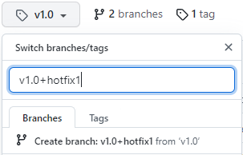

# ci-test

[](https://github.com/mdryden/ci-test/actions/workflows/ci.yml)

## Overview

A simple model of a release and pull request based CI/CD system, using github actions.

## Goals

1) A GitHub Release should trigger the creation of release artifacts.

2) Branches which are used to create releases should be protected; allowing commits only via pull request.

3) The main branch commit history should be clean, allowing only squashed pull requests.

4) Creating a patch release from a previous release (without including additional features from the main branch) should be straight forward and be similar to any other feature or release.

## GitHub Configuration

### Settings > Branches

Default branch: main

Branch protection rules: main
- [x] Require a pull request before merging
- [x] Require approvals

Branch protection rules: 

## Releases

Building release artifacts is initiated by publishing a GitHub Release.  The [release workflow](./.github/workflows/release.yml) runs the build pipeline when a release is published.


## Hot Fixes

### Hot Fix Branches

The hotfix branch should be treated like the main branch - changes should be introduced via code-reviewed pull-requests.  Use a prefix on the branches (eg patch/*) will allow the use of branch protection rules.

Hot fix branches should not be deleted, so that the tags are not orphaned.

### Creating a hot fix

1) Create a hotfix branch based off of the release tag.  Use a directory prefix on the branch which matches the configured protection rules.  This could be done several ways:

    a) From the command line: 
    ```
    $ git checkout origin/v1.0
    $ git checkout -b patch/v1.0.1
    $ git push --set-upstream origin patch/v1.0.1
    ```

    b) From the GitHub UI:
    - Find the release
    - Click the tag name to browse the code for that tag
    - Click the branch dropdown and create a new branch (eg: patch/v1.0.1) for the hotfix

    


2) Create a working branch off of the patch branch to fix the issue:
```
$ git checkout patch/v1.0.2
$ git checkout -b TicketNumberForHotfix
```

3) Make necessary changes and push to origin.

4) Create a pull request for the hotfix changes which targets the patch branch.


5) Review and merge the hotfix pull into the hotfix branch.

3) Create a new release using the hotfix branch as the target.  Increment the patch number of the original tag by one (eg: v1.0.1).

4) If the hotfix needs to be added to the main branch as well, checkout the main branch, create a working branch, then cherry pick the change from the patch branch into it and create a normal pull request.

If further hotfixes are required, follow the same procedure and based them off of the previous tag.